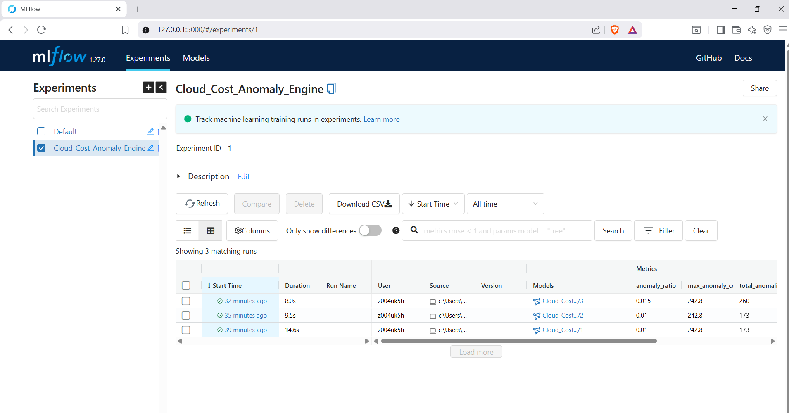

# 💰 Predictive Cloud Cost & Resource Optimizer (FinOps AI)

A production-grade, 100% offline MLOps pipeline and microservice. The system uses machine learning (**Isolation Forest**) to analyze cloud billing patterns, detect real-time budget anomalies (like runaway servers or infinite loops), and version models using a local **MLflow** registry.

---

## 🚀 Key Features & Capabilities

* **Machine Learning Engine**: Unsupervised outlier detection powered by Scikit-Learn's `IsolationForest` to analyze complex relationships between runtime usage metrics (`Usage_Amount`) and financial outlays (`Cost`).
* **Automated MLOps Governance**: Tracks experiments, parameters, validation charts, and code metrics locally.
* **Smart Validation Gate**: Programmatic quality control checks that evaluate model degradation (e.g., alert spamming, missed anomalies) before promotion.
* **Zero-Downtime Hot-Swaps**: Production APIs can reload active models in memory dynamically via administrative webhooks without service interruptions.
* **100% Local Architecture**: Requires zero cloud dependencies, zero network costs, and maintains total data privacy by utilizing a local **SQLite** database backend.

---

## 🛠 Tech Stack & Dependencies

* **Runtime Management**: [uv](https://github.com) (Fast, modern alternative to pip/pipenv)
* **Core Language**: Python 3.10+
* **Machine Learning**: Scikit-Learn, Pandas, NumPy, Matplotlib
* **MLOps Lifecycle Management**: MLflow (Tracking Engine & Local Model Registry)
* **Database Layer**: SQLite / SQLAlchemy 1.4
* **Microservice Layer**: FastAPI, Uvicorn, Pydantic (v2)

---

## 📁 Repository Structure

```text
predictive-cloud-cost-optimizer/
├── data/
│   └── cloud_cost_poc_data.csv    # Generated synthetic billing logs
├── cloud_optimizer.ipynb          # Experimentation, training & validation
├── api.py                         # Production FastAPI microservice script
├── mlflow.db                      # Local SQLite relational database (Auto-generated)
├── mlruns/                        # MLflow tracking run directory (Auto-generated)
└── README.md                      # Technical project guide
```

---

## 🔧 Installation & Environment Setup

This project utilizes `uv` for seamless, lightning-fast inline dependency isolation. You do not need to manually manage virtual environments.

### 1. Prerequisites

Ensure you have `uv` installed on your system. If not, install it using:

```bash
# macOS/Linux
curl -LsSf https://astral-sh.uv | sh

# Windows (PowerShell)
powershell -ExecutionPolicy ByPass -c "irm https://astral-sh.uv | iex"
```

### 2. Critical Database Driver Configuration

Because modern MLflow version registries conflict with SQLAlchemy 2.0+ over local SQLite connection methods, force install the long-term stable 1.4 branch into your working space:

```bash
uv pip install "SQLAlchemy<2.0" --force-reinstall
```

---

## 🏃‍♂️ Step-by-Step Execution Guide

### Step 1: Execute the Notebook Pipeline

Open `cloud_optimizer.ipynb` in your IDE or Jupyter interface and execute the cells consecutively. The lifecycle operates as follows:

1. **Data Ingestion**: Loads the historical multi-region billing logs from `data/cloud_cost_poc_data.csv`.
2. **Feature Engineering**: Runs `StandardScaler` normalizations and converts categoricals into sparse vectors.
3. **MLflow Tracking Run**: Trains the `IsolationForest` model while recording metrics (contamination factor, outlier counts) and logging artifacts (scatter plots, scalers) into the database.
4. **Validation Gate**: Evaluates the model against performance thresholds. If verified, it assigns the official mutable **`Production`** alias pointer to that model iteration inside the SQLite registry.

### Step 2: Boot Up the MLflow Dashboard UI

To view your experiments, audit model lineages, explore validation scatter charts, or manually track version parameters, run this command in your terminal terminal:

```bash
mlflow ui --backend-store-uri sqlite:///mlflow.db
```

Open your browser and navigate to: **`http://127.0.0.1:5000`**



### Step 3: Run the Production FastAPI Server

Launch the live prediction microservice. The app leverages `uv`'s inline script runner to resolve environment needs on the fly and invokes a `lifespan` manager to load the certified model directly from your SQLite data layer:

```bash
uv run api.py
```

* Interactive API Documentation (Swagger Docs): **`http://127.0.0.1:8000/docs`**

---

## 🔌 API Documentation & Integration Testing

### 1. Evaluate Live Metrics (`POST /predict`)

Pydantic enforces input validation (`Literal` types) to reject unlearned servers or regions with a structured `422 Unprocessable Entity` response before passing data to the model.

**Sample Request Payload:**

```bash
curl -X 'POST' \
  'http://127.0.0.1:8000/predict' \
  -H 'Content-Type: application/json' \
  -d '{
  "Usage_Amount": 50.0,
  "Cost": 950.0,
  "Service": "Lambda",
  "Region": "us-east-1"
}'
```

**Expected JSON Response (Anomaly Flagged):**

```json
{
  "is_anomaly": true,
  "anomaly_score": -0.1458923058140412,
  "meta": {
    "service_evaluated": "Lambda",
    "region_evaluated": "us-east-1",
    "cost_received": 950.0,
    "usage_received": 50.0
  },
  "incident_response": "ALERT: Triggering DevOps on-call infrastructure review"
}
```

### 2. Hot-Swap Live Engine (`POST /reload`)

When a new model version is verified and promoted in your notebook pipeline, you do not need to restart your production server. Trigger this endpoint via your CI/CD pipeline or an administrator script to reload the new model version with zero downtime:

```bash
curl -X 'POST' 'http://127.0.0.1:8000/reload'
```

---

## 📈 Commercial B2B SaaS Business Models

Integrating an automated MLOps tracking loop and high-performance API allows this solution to scale into a monetization vehicle:

* **Tiered Enterprise SaaS Subscription**: Charge enterprise organizations fixed montly premiums scaled to their active cloud architecture footprints (e.g., \$99/mo for small startups, \$999/mo for multi-cloud infrastructures).
* **Gain-Share FinOps Partnership**: Offer the platform at zero risk or low baselines while taking a performance percentage cut (**15% - 20%**) of verified infrastructure savings surfaced by your optimizer.
* **Automated Remediation Engine Upgrade**: Expand the architecture by connecting the API response hooks directly to cloud runbooks (e.g., AWS Lambda scripts) to automatically isolate or shut down flagged runaway instances without human intervention.
